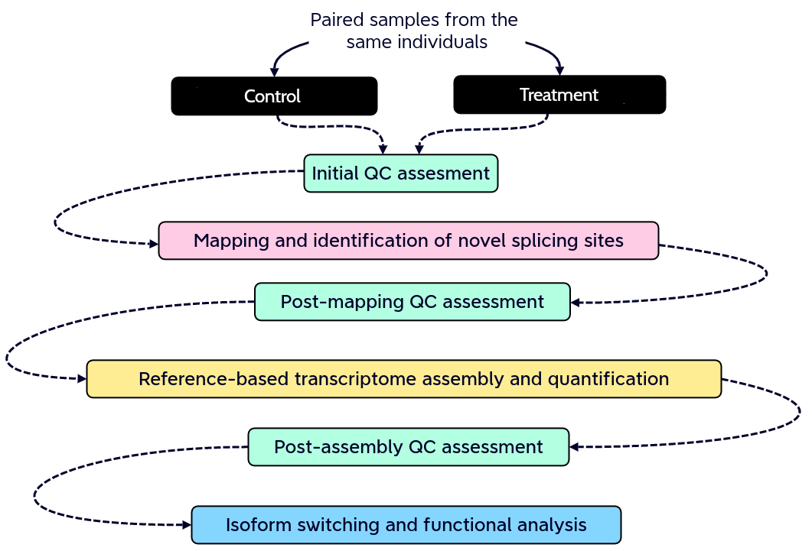
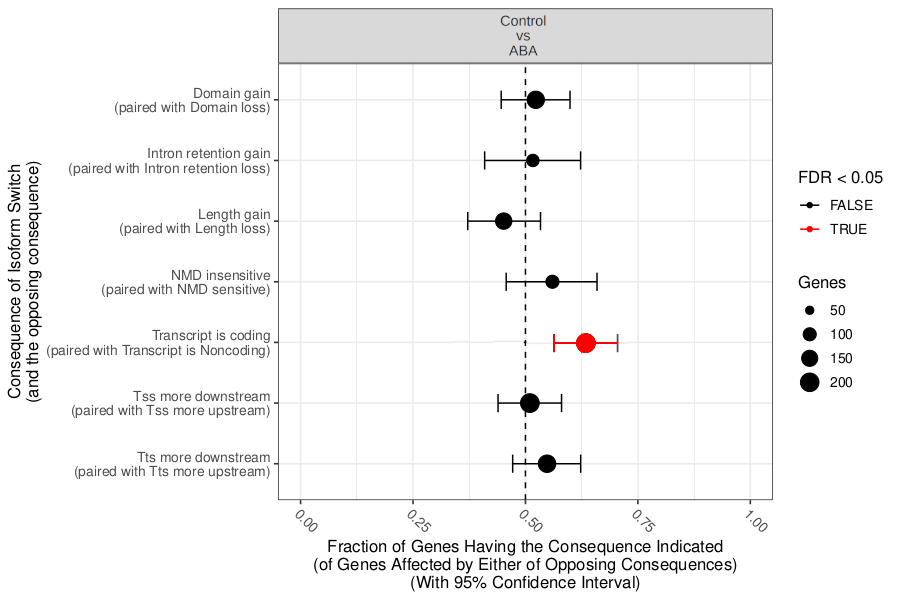

### **Galaxy: Illuminating Plant Biology throught Isoform Analysis and Beyond**

---

### Index of contents

- 1. Introduction
- 2. Galaxy workflow
- 3. Preliminary results

---

 What do we mean by non-canonical ORFs?

#### What are non-canonical isoforms?

Mean Ribo-Seq expression and Ribo-Seq expression standard deviation (SD). 

Source: Erady, Chaitanya, et al. "Pan-cancer analysis of transcripts encoding novel open-reading frames (nORFs) and their potential biological functions." NPJ Genomic Medicine 6.1 (2021): 4.

---

How identify non-canonical ORFs?

### How identify non-canonical isoforms?

---

Galaxy Workflow

#### Galaxy Workflow

Full detailed explanation in the <a href="https://gxy.io/GTN:T00345">Genome-wide alternative splicing analysis</a> Galaxy training. 

---

#### Mapping and identication of novel splicing sites with RNASTAR

Two-pass alignment enables sequence reads to span novel splice junctions by fewer nucleotides, conferring greater read depth and providing significantly more accurate quantification of novel splice junctions.

---

#### Reference-based transcriptome assembly and quantification with StringTie

StringTie is a fast and highly efficient assembler of RNA-seq alignments into potential transcripts.

---

#### Isoform switching and functional analysis with IsoformSwitchAnalyzeR

IsoformSwitchAnalyzieR performs the differential isoform usage analysis by using DEXSeq.

---

#### Isoform switching and functional analysis with IsoformSwitchAnalyzeR

To analyze large-scale patterns in predicted IS consequences, IsoformSwitchAnalyzeR computes all isoform switching events resulting in a gain/loss of a specific consequence (e.g. protein domain gain/loss).

---

Preliminary results

#### Isoform switching and functional analysis with IsoformSwitchAnalyzeR

The complete analysis can be found in this <a href="https://usegalaxy.eu/u/gallardoalba/h/genome-wide-splicing-history">Galaxy history</a>.

The complete analysis can be found in this <a href="https://usegalaxy.eu/u/gallardoalba/h/genome-wide-splicing-history">Galaxy history</a>.

---

Thanks for you attention!
